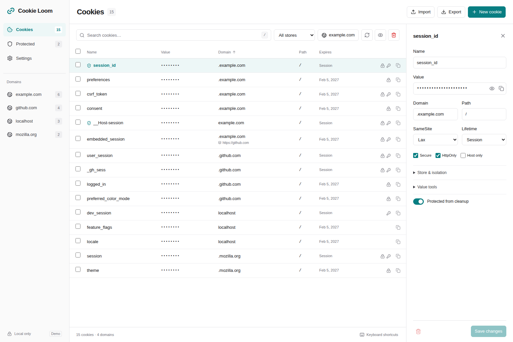

# Cookie Loom

**Your cookies, untangled.** A private cookie manager for everyday browsing
and developer work, with a quick site popup and a full cookie workbench.

Cookie Loom is an independent, substantial rewrite of
[Cookie Quick Manager](https://github.com/ysard/cookie-quick-manager), with a
new TypeScript / React codebase and shared Chromium and Firefox builds. It
continues under GPL-3.0-or-later and retains the original project's history and
attribution. See [NOTICE](NOTICE) and [the migration guide](docs/migration.md).

**Status: 0.1.0 development preview.** Build and load it locally using the
instructions below. No Cookie Loom browser-store release is claimed here.
Targets are desktop Chromium 132+ and Firefox 140+; browser-specific behavior
must be verified on the versions you use. Safari and mobile are not current
release targets.



## A small popup. A capable workbench.

- **Current-site controls:** inspect the current site's cookies, protect what
  you want to keep, and clear the rest with an explicit confirmation.
- **Full workbench:** search and filter cookies, inspect values and attributes,
  and create, edit, or delete individual records. Values start masked, with
  reveal and copy controls close at hand.
- **Context-aware operations:** keep stores, Firefox containers, first-party
  domains, and supported partition keys distinct. Copy selected cookies into
  another store only after confirming the destination.
- **Developer value tools:** URL and UTF-8 Base64 conversion edits a draft
  before you save it.
- **Safer cleanup:** protected identities are skipped; available undo is
  limited to five minutes in the open workbench tab. Automatic startup cleanup
  is opt-in.
- **Local transfers:** preview native JSON, legacy JSON, or Netscape imports;
  export selected data deliberately. Native JSON retains the richest metadata.
- **A quieter interface:** restrained teal, system/light/dark themes, readable
  controls, compact layouts, and keyboard shortcuts for search and help.

Edits stay in a draft until saved. Cookie Loom warns before discarding changes
and lets you reload a cookie that changed in the browser.

Protection only affects Cookie Loom cleanup. It cannot stop websites, cookie
expiry, other extensions, or browser settings from deleting cookies. Undo is
best effort, not a backup. Cookie exports may contain usable login credentials.

## Privacy by default

There is no account, telemetry, cloud service, remote application code, or
background upload. Preferences and protected identities stay in local
extension storage. Cookie values remain in the browser, temporary working
memory, or a file/clipboard export you explicitly request.

The extension asks you to grant HTTP/HTTPS website access before it can manage
cookies. This is an explicit **all-websites grant**, including when opening
the current-site popup; a per-site permission mode is not yet implemented.
The Firefox build also declares container access. You can revoke website access
in your browser's extension settings. Optional scripting access is requested
only for confirmed local storage cleanup on the active page.

Read the [privacy policy](PRIVACY.md) and [security policy](SECURITY.md) before
using sensitive browser sessions. The [usage guide](docs/usage.md) explains
search syntax, cleanup scope, and import behavior.

## Try the demo

Use Node.js 24 and npm:

```sh
npm ci
npm run dev
```

Open the local URL printed by Vite, normally `http://localhost:5173`.
The demo uses synthetic cookies and never accesses your actual browser cookie
store. It is useful for exploring the interface, not verifying extension APIs.

## Build the extension

```sh
npm run build
```

**Chromium:** open `chrome://extensions`, enable **Developer mode**, select
**Load unpacked**, and choose `apps/extension/.output/chrome-mv3`.

**Firefox:** open `about:debugging#/runtime/this-firefox`, select **Load Temporary
Add-on**, and choose `apps/extension/.output/firefox-mv3/manifest.json`.
This is a temporary development installation; normal distribution requires
[Mozilla signing](https://extensionworkshop.com/documentation/publish/signing-and-distribution-overview/).

Use a disposable browser profile for development. To run WXT's development
workflow directly, use `npm run dev:chrome` or `npm run dev:firefox`.

## Develop and contribute

```sh
npm run format:check
npm audit --omit=dev
npm run check
npm test
npm run build
npm run lint:firefox
npx playwright install chromium firefox
npm run test:e2e
npm run test:firefox
```

The npm workspace contains:

```text
apps/extension/   WXT extension, React interface, browser adapter, local demo
packages/core/    Cookie identity, validation, filters, import/export rules
docs/            Architecture, development, migration, verification, releases
legacy/          Original extension and historical documentation/assets
```

Start with [CONTRIBUTING.md](CONTRIBUTING.md),
[development instructions](docs/development.md), and
[architecture decisions](docs/architecture.md). See
[browser verification](docs/verification.md) for real-extension checks and
[the release guide](docs/releasing.md) for packaging and store preparation.
`npm run zip` creates unsigned browser-specific archives for review.

See the [dependency review](docs/dependency-review.md) for the remaining
development-tool advisories; the production dependency audit is clean.

Report bugs and ideas in [this repository's issues](https://github.com/q1/cookie-quick-manager/issues).
Use synthetic data and redact cookie values. Report vulnerabilities through
[private vulnerability reporting](https://github.com/q1/cookie-quick-manager/security/advisories/new),
following [SECURITY.md](SECURITY.md).

## Origins and license

Cookie Quick Manager was created by Ysard and contributors. Cookie Loom is an
independent continuation with a new name, interface, architecture, and release
identity; it is not an upstream-endorsed update. The original source and notices
are preserved in `legacy/`, which is excluded from the new builds.

Licensed under [GNU GPL version 3 or later](LICENSE). Original copyright:
2017–2019 Ysard. New work: 2026 Cookie Loom contributors. See [NOTICE](NOTICE)
for lineage and third-party attribution.
